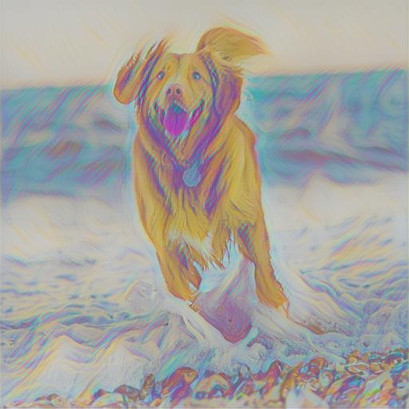
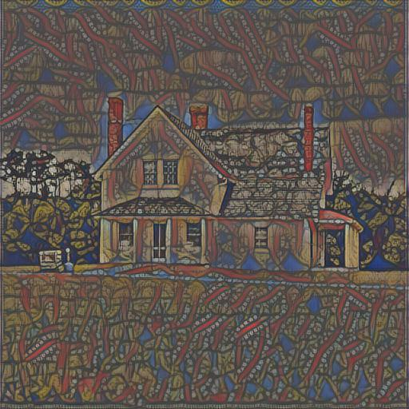
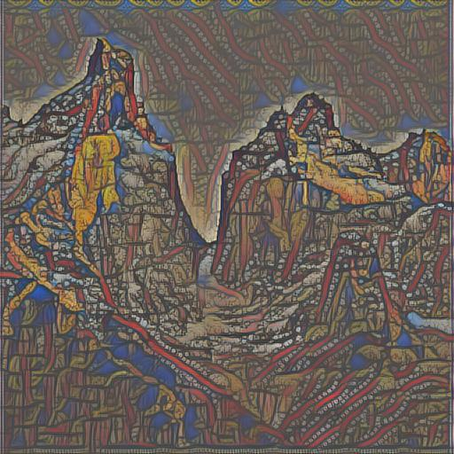

# Neural Style Transfer

A Tensorflow 2 implementation of neural style transfer using the approach described in [Perceptual Losses for Real-Time Style Transfer and Super-Resolution](https://arxiv.org/abs/1603.08155).

### Usage

Download the data required to train the model. This downloads the COCO 2014 train images.
```bash
$ python runner.py --task download_data
```
To train the model, run the following command.
The models trained are style specific i.e., 1 model per style image.
The hyperparameters used to train the model can be modified in `runner.py`.
It is important to tune the `content_weight` and `style_weight` parameters to control how heavily the images are styled.
Training takes about 1 hour on a Tesla V100 GPU. 
```bash
$ python runner.py --task train --run_id <id> --style_image_path <path_to_style_image>
```
To generate a stylized image using a trained model, run the following. Modify the `content_image_size` parameter in `runner.py` to control the size of the output image.
```bash
$ python runner.py --task stylize_image --run_id <id> --content_image_path <path_to_original_image> --output_image_path <path_to_save_stylized_image>
```

### Examples

|                                                                               |   |   |
|-------------------------------------------------------------------------------|----------------------------------------------------------------------------|------------------------------------------------------------------------------------|
|     |     |     |
|   |   |   |
||||